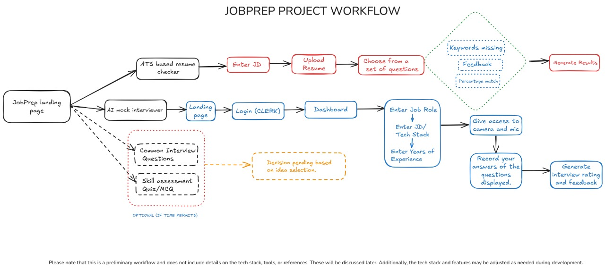

# Hirize - The Ultimate Job Preparation Platform
Hirize is an all-in-one job preparation platform designed to help candidates become job-ready by leveraging AI-driven tools. It bridges the gap between job seekers and recruiters by providing structured and personalized career support. Our platform ensures an effective job preparation process through resume optimization, mock interviews, skill assessments, and job readiness insights.

## Key Features
### 1. ATS-Based Resume Checker
- Analyzes and optimizes resumes to meet Applicant Tracking System (ATS) standards.
- Ensures higher visibility to recruiters by enhancing resume compatibility.
### 2. AI-Powered Mock Interviewer
- Conducts real-time mock interviews using Natural Language Processing (NLP).
- Evaluates responses based on clarity, confidence, and relevance.
- Provides constructive feedback for improvement.
### 3. Skill Assessment and Learning Modules
- Offers domain-specific tests and learning resources.
- Helps candidates improve both technical and soft skills.
- Generates job readiness reports highlighting strengths and areas for improvement.

## Workflow

## Why Hirize is Different
Hirize is a comprehensive placement-ready portal that integrates multiple job preparation resources in one place, making the job search and preparation process seamless. Unlike traditional job portals, Hirize provides:

- A unified platform for resume optimization, interview preparation, job postings, and skill assessments.
- AI-driven assistance for personalized career guidance and improvement.
- Exclusive study materials and resources tailored for various job roles.

## Technologies Used

### Frontend
- HTML, CSS, JavaScript (for the landing page UI)
- Next.js (React Framework) with Tailwind CSS for styling
### Backend
- Python, JavaScript
- PostgreSQL with Drizzle ORM for database management

### Authentication
- Clerk (for social and email-password authentication)

### AI Integration
- Google Gemini API and Generative AI for AI-powered question generation and resume analysis
- Streamlit for deploying the ATS resume scanner and AI mock interviewer
### Libraries Used
- FAISS-CPU (Vector search for ranking resumes)
- Groq, LangChain-Groq, LangChain, LangChain-Google-GenAI, LangChain-Community
- PyPDF, Python-Dotenv
- Google Cloud AI Platform (>=1.38)
### Methods and Algorithms Used
- Text Extraction: PyPDF2, PyPDF for parsing resumes.
- ATS Optimization: NLP techniques for ensuring ATS compliance.
- Vector Search: FAISS for similarity-based ranking.
- Question Generation: Google Gemini API + LangChain for role-specific interview questions.
- Speech-to-Text: Web mic access for real-time recording and conversion.
- AI Evaluation: Groq-powered analysis of interview responses based on clarity, confidence, and relevance.

## Deployment
- Vercel (for hosting the main application)
- Streamlit (for AI-powered ATS scanning and mock interviews)

## Conclusion
Hirize is the ultimate job preparation platform that streamlines the hiring process for candidates. With AI-driven tools and a structured approach, we help job seekers enhance their employability and increase their chances of securing their dream jobs. Join us on this journey to make job preparation seamless and effective!
